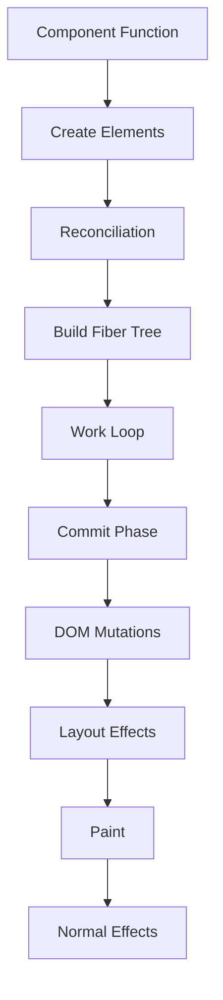

RyunixJS provides a modern, concurrent rendering model with robust support for Client-Side Rendering (CSR), Server-Side Rendering (SSR), and Island Architecture.

## Client-Side Rendering (CSR)

### render()

The entry point for rendering a RyunixJS virtual DOM tree into a physical DOM container.

```javascript
import { render, createElement } from '@unsetsoft/ryunixjs'

const App = () => {
  return createElement('div', null, 'Hello, RyunixJS!')
}

render(createElement(App), document.getElementById('root'))
```

**Signature:**
```javascript
const root = render(element, container)
```

**How it works:**
1. Clears the container to prevent duplication
2. Creates a Work-In-Progress root (`wipRoot`)
3. Schedules work using `scheduleWork()`
4. Returns the root fiber for inspection

**Source implementation:**
```javascript
const render = (element, container) => {
  const state = getState()
  clearContainer(container)
  
  const root = {
    dom: container,
    props: { children: [element] },
    alternate: state.currentRoot,
    isHydrating: false,
    hydrateCursor: null,
  }
  
  scheduleWork(root)
  return root
}
```

<Note>
  `render()` completely replaces the container's contents. Use `hydrate()` for server-rendered content.
</Note>

### hydrate()

Attaches RyunixJS to an existing server-rendered HTML tree.

```javascript
import { hydrate, createElement } from '@unsetsoft/ryunixjs'

const App = () => {
  return createElement('div', null, 'Hello, RyunixJS!')
}

// Assumes server-rendered HTML already exists in #root
hydrate(createElement(App), document.getElementById('root'))
```

**Key differences from render():**
- Preserves existing DOM nodes instead of clearing
- Walks the DOM using `hydrateCursor`
- Attaches event listeners and state to existing elements
- Provides much faster initial load

**How hydration works:**

1. **DOM Matching**: Compares virtual DOM against existing DOM nodes
2. **Type Checking**: Validates that element types match
3. **Event Attachment**: Adds event listeners to existing nodes
4. **State Initialization**: Sets up component state and hooks
5. **Mismatch Handling**: Falls back to CSR if hydration fails

```javascript
// Hydration cursor moves through DOM during reconciliation
const hydrate = (element, container) => {
  const state = getState()
  
  const root = {
    dom: container,
    props: { children: [element] },
    alternate: state.currentRoot,
    isHydrating: true,
    hydrateCursor: nextValidSibling(container.firstChild),
  }
  
  scheduleWork(root)
  return root
}
```

<Warning>
  Hydration mismatches occur when server-rendered HTML doesn't match client-rendered output. RyunixJS will warn in development mode and fall back to CSR.
</Warning>

### init()

Smart initialization that automatically chooses between render and hydrate.

```javascript
import { init, createElement } from '@unsetsoft/ryunixjs'

const App = () => {
  return createElement('div', null, 'Hello, RyunixJS!')
}

const components = {
  Counter: CounterComponent,
  Header: HeaderComponent
}

init(createElement(App), 'root', components)
```

**Signature:**
```javascript
const root = init(MainElement, rootId = '__ryunix', components = {})
```

**Parameters:**
- `MainElement` - Root component element
- `rootId` - DOM container ID (defaults to `'__ryunix'`)
- `components` - Island components registry

**Decision logic:**
```javascript
if (process.env.RYUNIX_SSR && containerRoot.hasChildNodes()) {
  // SSR content detected - use hydration
  hydrate(MainElement, containerRoot)
  hydrateIslands(components, true)
} else {
  // No SSR content - use normal render
  render(MainElement, containerRoot)
  hydrateIslands(components, false)
}
```

<Tip>
  Use `init()` for production apps - it handles SSR detection automatically and manages island hydration.
</Tip>

## Island Architecture

RyunixJS supports **Partial Hydration** via "Islands" - mostly-static pages ship minimal JavaScript by only hydrating specific interactive components.

### hydrateIslands()

Scans the DOM for island components and hydrates them independently.

```javascript
import { hydrateIslands } from '@unsetsoft/ryunixjs'

const components = {
  'Counter': CounterComponent,
  'SearchBox': SearchBoxComponent
}

hydrateIslands(components)
```

**How it works:**

1. **Discovery**: Finds elements with `data-ryunix-island` attribute
2. **Lookup**: Matches component ID to registry or `window.__RYUNIX_ISLANDS__`
3. **Props Extraction**: Parses `data-props` attribute
4. **Hydration**: Calls `hydrate()` on the isolated container

**Example island markup:**
```html
<div data-ryunix-island="Counter" data-props='{"initialCount":0}'>
  <button>Count: 0</button>
</div>
```

**Creating island components:**
```javascript
const Counter = ({ initialCount }) => {
  const [count, setCount] = useStore(initialCount)
  return createElement('button',
    { onClick: () => setCount(count + 1) },
    `Count: ${count}`
  )
}

// Mark as island
Counter.ryunix_client_id = 'Counter'
```

<Note>
  Islands shielded inside a `ServerBoundary` won't be hydrated if a main element is managing page hydration.
</Note>

## Server-Side Rendering (SSR)

### renderToString()

Synchronously renders a virtual DOM tree to an HTML string.

```javascript
import { renderToString, createElement } from '@unsetsoft/ryunixjs/server'

const App = () => {
  return createElement('div', null, 'Hello, RyunixJS!')
}

const html = renderToString(createElement(App))
// Returns: <div>Hello, RyunixJS!</div>
```

**Features:**
- Synchronous rendering
- XSS protection with automatic escaping
- Injects necessary attributes for hydration
- Handles styles and metadata

**Use cases:**
- Static site generation
- Simple server rendering
- Email templates

### renderToReadableStream()

Asynchronously renders to a Web `ReadableStream` for streaming SSR.

```javascript
import { renderToReadableStream } from '@unsetsoft/ryunixjs/server'

app.get('/', async (req, res) => {
  const stream = await renderToReadableStream(
    createElement(App, { url: req.url })
  )
  
  res.setHeader('Content-Type', 'text/html')
  stream.pipeTo(res)
})
```

**Advantages:**
- Out-of-order streaming
- Early flushes for faster TTFB (Time To First Byte)
- Progressive rendering
- Native `Suspense` support

**How Suspense streaming works:**

1. **Fallback First**: Streams skeleton UI immediately
2. **Background Tasks**: Waits for async data in background
3. **Template Injection**: Streams `<template>` tags with actual content
4. **Client Swap**: Small JavaScript helper (`$RC`) swaps fallback with real content

```javascript
const Page = () => {
  return createElement(
    Suspense,
    { fallback: createElement('div', null, 'Loading...') },
    createElement(AsyncData)
  )
}

// Server streams:
// 1. <div>Loading...</div>
// 2. Later: <template id="S:1"><div>Real data</div></template>
// 3. <script>$RC("S:1")</script>
```

<Tip>
  Use streaming for better perceived performance. Users see content faster even if total load time is the same.
</Tip>

## Rendering Pipeline

Understanding the complete render cycle:



### 1. Render Phase

- Component functions execute
- Virtual DOM elements created
- Reconciler compares with previous tree
- Effect tags assigned (PLACEMENT, UPDATE, DELETION)

### 2. Commit Phase

- Deletions executed first
- DOM mutations applied synchronously
- `useLayoutEffect` runs synchronously
- `useEffect` scheduled for after paint

### 3. Effect Phase

- `useLayoutEffect` callbacks run (synchronous)
- Browser paints
- `useEffect` callbacks run (asynchronous)

## Hydration Best Practices

### 1. Match Server and Client Output

```javascript
// ❌ Bad - causes hydration mismatch
const Time = () => {
  return createElement('div', null, new Date().toString())
}

// ✅ Good - consistent output
const Time = ({ timestamp }) => {
  return createElement('div', null, new Date(timestamp).toString())
}
```

### 2. Handle Browser-Only APIs

```javascript
const Component = () => {
  const [mounted, setMounted] = useStore(false)
  
  useEffect(() => {
    setMounted(true)
  }, [])
  
  // Only render client-specific content after mount
  const windowWidth = mounted ? window.innerWidth : null
  
  return createElement('div', null, windowWidth || 'Loading...')
}
```

### 3. Use ServerBoundary for Server-Only Content

```javascript
import { ServerBoundary } from '@unsetsoft/ryunixjs'

const Page = () => {
  return createElement('div', null,
    createElement(ServerBoundary, null,
      // This won't hydrate on client
      createElement(DatabaseList)
    ),
    createElement(InteractiveWidget) // This will hydrate
  )
}
```

## Performance Optimization

### Lazy Loading with Islands

Only hydrate interactive components:

```javascript
// Static content - no JavaScript shipped
const Article = () => {
  return createElement('article', null, content)
}

// Interactive island - JavaScript shipped only for this
const CommentWidget = () => {
  const [comments, setComments] = useStore([])
  // ... interactive logic
}
CommentWidget.ryunix_client_id = 'CommentWidget'
```

### Streaming for Faster TTFB

```javascript
import { renderToReadableStream } from '@unsetsoft/ryunixjs/server'

const App = () => {
  return createElement('html', null,
    createElement('head', null, /* ... */),
    createElement('body', null,
      createElement(Header), // Streams immediately
      createElement(Suspense, 
        { fallback: createElement(Skeleton) },
        createElement(SlowData) // Streams when ready
      )
    )
  )
}
```

## Debugging

Enable debug mode for hydration insights:

```bash
RYUNIX_DEBUG=true npm start
```

Debug logs show:
- Hydration start/end
- Mismatch warnings with details
- Node placement vs. hydration decisions

```
[Ryunix Debug] init: SSR content detected. Starting hydration on #root
[Ryunix Debug] Hydrating node: div
[Hydration] Mismatch at h1. Expected text but got h1. Falling back to CSR.
[Ryunix Debug] commitRoot - isHydrating: true, hydrationFailed: false
```

## Related

- [Virtual DOM & Reconciliation](/core/virtual-dom-reconciliation) - How reconciliation works
- [Components](/core/components) - Component architecture
- [Server Actions](/webpack/server-actions) - Server-side data mutations